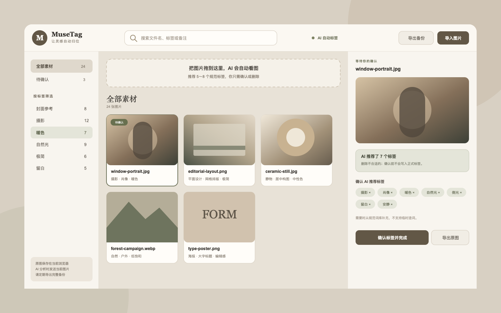

<div align="center">
  
  <h1>MuseTag</h1>
  <p><strong>让灵感自动归位。</strong></p>
  <p>面向个人创作者的 AI 图片标签素材库：拖入图片，自动推荐 5～8 个规范标签，你只需删除不合适的并确认。</p>
  <p>
    
    
    
    
  </p>
  <p>
    <a href="#安装-skill">安装 Skill</a> ·
    <a href="#运行素材库">运行素材库</a> ·
    <a href="docs/USER_GUIDE.md">使用说明书</a> ·
    <a href="docs/index.html">产品展示页</a>
  </p>
</div>

<p align="center">
  
</p>

## 为什么做 MuseTag

收藏图片很快，整理图片却经常卡在“应该写什么标签”。让 AI 自由生成又会产生大量近义词：`封面`、`封面图`、`封面素材` 最终指向同一件事，却让搜索越来越乱。

MuseTag 把 AI 的角色限定为**从已有词库里做选择**，而不是随意创造词语：

> **拖入图片 → AI 看图 → 推荐 5～8 个规范标签 → 删除或补选 → 确认完成**

确认前，AI 建议与正式标签分开保存，不会污染素材库。识别失败时，原图依然已经安全写入本地。

## 核心能力

| 能力 | MuseTag 的处理方式 |
| --- | --- |
| AI 看图 | 导入后自动分析，按检索价值推荐 5～8 个标签 |
| 标签治理 | AI 只能从受控词表选择，程序再次过滤与去重 |
| 人工确认 | 点击标签即可删除；需要时从分组词库补选 |
| 素材检索 | 支持文件名、标签、备注搜索与多标签 AND 筛选 |
| 原图管理 | 浏览器保存原文件，可看大图并按原格式导出 |
| 数据保护 | 完整备份包含图片、标签、备注、来源和 AI 状态 |
| 失败回退 | 没有密钥或网络异常时可重试，也可手动选择规范标签 |

## 受控标签体系

内置词库按十个维度组织，每张图片只选择最有助于以后找回的少量标签。

| 用途与类型 | 画面事实 | 视觉语言 |
| --- | --- | --- |
| 用途、媒介 | 主体、场景 | 构图、版式、色彩、光线、风格、氛围 |
| 封面参考、摄影 | 人物、咖啡馆 | 留白、低饱和、侧光、编辑感、安静 |

体系借鉴 [Getty Art & Architecture Thesaurus](https://www.getty.edu/research/tools/vocabularies/aat/)、[Library of Congress TGM](https://www.loc.gov/pictures/collection/tgm/fields.html)、[IPTC Photo Metadata Standard](https://iptc.org/standards/photo-metadata/iptc-standard/)、[Adobe Lightroom Keywords](https://helpx.adobe.com/lightroom-classic/desktop/organize-photos-in-lightroom-classic/keywords.html) 与 [Adobe Stock metadata guidance](https://helpx.adobe.com/stock/contributor/content-policies-guidelines/metadata/tips-effective-titles-keywords.html)，再裁剪成适合个人设计素材库的中文小词表。

完整标签、维护规则与 AI 约束见 [受控标签体系说明](skills/musetag/references/tag-taxonomy.md)。

## 安装 Skill

```bash
npx skills add https://github.com/Mona-ziranyun/musetag-skill --skill musetag
```

安装后可以直接告诉 Codex：

```text
使用 $musetag 创建一个可运行的 AI 图片标签素材库。
```

或者让它改进现有项目：

```text
使用 $musetag 把我的图片素材库改成“AI 推荐、人工确认”的受控标签流程。
```

Skill 会优先从仓库自带的可运行模板开始，同时遵守标签治理、本地存储、备份恢复和界面质量规则。

## 运行素材库

### 1. 生成项目

需要 Node.js 20.19+ 与 Python 3。

```bash
python3 skills/musetag/scripts/create_asset_box.py ./musetag-app
cd musetag-app
```

### 2. 配置 AI

```bash
cp .env.example .env
```

在 `.env` 中填写自己的 OpenAI API Key：

```text
OPENAI_API_KEY=你的_API_Key
```

可选模型配置：

```text
OPENAI_MODEL=gpt-5.6-luna
```

### 3. 启动

```bash
npm install
npm run dev
```

打开终端显示的本地地址，将 JPG、PNG 或 WebP 拖入页面即可。详细操作见 [MuseTag 使用说明书](docs/USER_GUIDE.md)。

## 数据与隐私

- 图片原文件、正式标签、备注和 AI 状态保存在当前浏览器的 IndexedDB。
- 进行 AI 分析时，当前图片会发送到用户配置的 OpenAI API。
- API Key 只由本地服务读取，不写入前端代码、浏览器数据库或备份文件。
- AI 请求设置 `store: false`；实际数据处理边界以 [OpenAI API data controls](https://developers.openai.com/api/docs/guides/your-data) 为准。
- 浏览器数据仍可能被用户清理，请保留来源原图并定期导出完整备份。
- 删除操作只影响素材库中的副本，不修改来源文件。

## 项目结构

```text
musetag-skill/
├── README.md
├── docs/
│   ├── index.html                 卡其色产品展示页
│   ├── showcase.png              GitHub 首页高清展示图
│   ├── showcase.svg              可编辑的矢量展示图
│   └── USER_GUIDE.md              完整使用说明书
└── skills/musetag/
    ├── SKILL.md                   Skill 核心指令
    ├── agents/openai.yaml         名称、简介与默认提示
    ├── assets/starter/            可运行的 Vite + IndexedDB + AI 模板
    ├── references/                产品、词表、AI、界面、存储和验收规范
    └── scripts/create_asset_box.py 项目生成器
```

## 设计原则

- **受控，而不是发散**：AI 只选择规范词，不临时造词。
- **确认，而不是录入**：用户主要做删除和确认，不反复打字。
- **找回，而不是描述**：标签优先服务以后搜索，不追求面面俱到。
- **本地优先，边界透明**：素材库留在本地，AI 发送范围明确说明。
- **可恢复**：备份同时包含原图与全部元数据。

## 文档

- [产品规范](skills/musetag/references/product-spec.md)
- [AI 看图集成](skills/musetag/references/ai-integration.md)
- [受控标签体系](skills/musetag/references/tag-taxonomy.md)
- [存储与备份](skills/musetag/references/storage-and-backup.md)
- [交付验收清单](skills/musetag/references/acceptance-checklist.md)

## License

[MIT](LICENSE)
